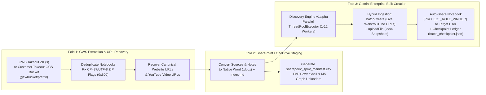

# 🚀 GWS NotebookLM → SharePoint & Gemini Enterprise (NotebookLM Enterprise) Migrator

An enterprise **3-Fold Technical Admin Migration Pipeline & Web Workbench** designed for organizations migrating **NotebookLM** notebooks from **Google Workspace (GWS)** to **Microsoft 365 (SharePoint Online / OneDrive `.docx`)** and **Gemini Enterprise (NotebookLM Enterprise via Discovery Engine `v1alpha` API)** — supporting both **Single-User Pilot Migrations** and **100-User Batch Waves**.

---

## 🏗️ 3-Fold Enterprise Architecture



---

## ✨ Key Technical Capabilities

1. **Zero Duplicate Folders on Windows/macOS (`flag_bits = 0x0800`)**:
   Enforces bit 11 (`0x0800` UTF-8 filename encoding) on every ZIP entry inside `SharePoint_Ready_Notebooks.zip`, eliminating legacy DOS CP437 mojibake duplicate folders (`...nci¢n t,cnica` vs `...nción técnica`) for Spanish/non-ASCII titles.
2. **100% Canonical URL Recovery (`SOURCE_CONTENT_TYPE_URL` & `SOURCE_CONTENT_TYPE_YOUTUBE_VIDEO`)**:
   - Reconstructs full YouTube links (`https://www.youtube.com/watch?v=<videoId>`) and channel metadata from `Sources/<Title> metadata.json`.
   - Recovers canonical website URLs omitted from Takeout `metadata.json` by analyzing preserved self-anchor (`#bodyContent`, `#MainContent`, `#overview`) and slug-matched `<a href>` tags in `Sources/<Title>.html`.
3. **Why Hybrid (`batchCreate` + `uploadFile`) Beats `agentspaceContent` for Shared Notebooks**:
   - In Discovery Engine `v1alpha`, 3P connector documents (`agentspaceContent`) cannot be added to shared notebooks.
   - Converting static file sources to native `.docx` (stored in SharePoint/OneDrive as the system of record) and uploading via `sources:uploadFile` while linking public Websites/YouTube via `sources:batchCreate` gives users full `notebooks:share` (`PROJECT_ROLE_WRITER`) collaboration in Gemini Enterprise.
4. **100-User Wave Batch Engine**:
   - **Multi-ZIP & GCS Customer Takeout Sync**: Ingests 100 per-user Takeout `.zip` files or syncs directly from a GWS Customer Takeout GCS bucket (`gs://<bucket>/<export_id>/<user@domain>/Takeout/NotebookLM/`).
   - **SharePoint Bulk Migration Ready**: Generates `sharepoint_spmt_manifest.csv` (compatible with **Microsoft SharePoint Migration Tool (SPMT)**), `scripts/upload_to_sharepoint_pnp.ps1` (**PnP PowerShell**), and `scripts/upload_to_sharepoint_graph.py` (**Microsoft Graph API v1.0**).
   - **Resumable Parallel Provisioning**: Uses a bounded `ThreadPoolExecutor`, automatic HTTP `429`/`5xx` exponential backoff, and an atomic `batch_checkpoint.json` ledger so interrupted 100-user waves resume without duplicating notebooks.

---

## 🚀 Quickstart

### 1. Install Dependencies & Launch the Web Workbench
```bash
pip install -r requirements.txt
python3 gws_to_ge_notebooklm_migrator.py --serve --port 8765
```
Open **`http://localhost:8765`** in your browser.

### 2. Run via CLI (Single User or 100-User Wave)

#### Extract & Build SharePoint Package from One or Multiple Takeout ZIPs:
```bash
python3 gws_to_ge_notebooklm_migrator.py \
  --extract-zip takeout-user001@domain.com.zip takeout-user002@domain.com.zip \
  --user-mapping-csv templates/user_mapping_template.csv
```

#### Sync Directly from a GWS Customer Takeout GCS Bucket & Provision to Gemini Enterprise:
```bash
python3 gws_to_ge_notebooklm_migrator.py \
  --gcs-bucket gs://my-gws-customer-takeout-bucket/export_wave_01/ \
  --user-mapping-csv templates/user_mapping_template.csv \
  --migrate-ge-project 123456789012 \
  --location global \
  --max-workers 6
```

### 3. Bulk-Upload `.docx` Packages to SharePoint Online / OneDrive

- **Option A — Microsoft SharePoint Migration Tool (SPMT)**:
  Import `/tmp/nblm_migration_workspace/sharepoint_staging/sharepoint_spmt_manifest.csv` directly into SPMT.
- **Option B — PnP PowerShell**:
  ```powershell
  pwsh ./scripts/upload_to_sharepoint_pnp.ps1 -ManifestCsv /tmp/nblm_migration_workspace/sharepoint_staging/sharepoint_spmt_manifest.csv
  ```
- **Option C — Microsoft Graph API (Python)**:
  ```bash
  export MS_GRAPH_TOKEN="<your-graph-bearer-token>"
  python3 scripts/upload_to_sharepoint_graph.py \
    --manifest-csv /tmp/nblm_migration_workspace/sharepoint_staging/sharepoint_spmt_manifest.csv \
    --drive-id "b!xxxx"
  ```
