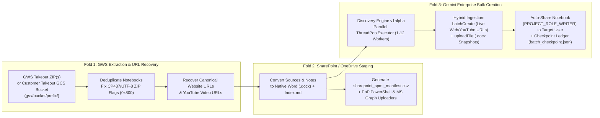

# 🚀 GWS NotebookLM → SharePoint & Gemini Enterprise (NotebookLM Enterprise) Migrator

An enterprise **3-Fold Technical Admin & Self-Service Migration Pipeline + Web Workbench** designed for organizations migrating **NotebookLM** notebooks from **Google Workspace (GWS)** to **Microsoft 365 (SharePoint Online / OneDrive `.docx`)** and **Gemini Enterprise (NotebookLM Enterprise via Discovery Engine `v1alpha` API)** — supporting both **Track A: Business User Self-Service Migrations** and **Track B: Technical Admin 100-User Batch Waves**.

---

## 🏗️ 3-Fold Enterprise Architecture



---

## 📋 Prerequisites & IAM Permissions Matrix

| Component | Track A: Business User Self-Migration | Track B: Technical Admin (100-User Batch Wave) |
| :--- | :--- | :--- |
| **Google Workspace (Source)** | Standard User account (`https://takeout.google.com`) | **GWS Super Admin** to run **Customer Takeout** (`https://admin.google.com/ac/customertakeout`) scoped to an Organizational Unit (OU) |
| **Google Cloud Storage (Batch Only)** | _Not required (uses local `.zip`)_ | GCS Bucket granting `Storage Object Creator` + `Storage Legacy Bucket Writer` to `dasher-customer-takeout@system.gserviceaccount.com` |
| **SharePoint / OneDrive (Fold 2)** | Write access to personal OneDrive or team SharePoint folder | **SharePoint Admin** or App Registration (`Files.ReadWrite.All`) to run **Microsoft SPMT**, **PnP PowerShell**, or **MS Graph API** |
| **Gemini Enterprise / GCP (Fold 3)** | `roles/discoveryengine.notebookLmUser` on the target GCP Project | `roles/discoveryengine.notebookLmAdmin` (or `notebookLmUser`) on the target GCP Project (supports Human Admin or GCP Service Account via `?serviceAccountUser=true`) |
| **Identity Provider Support** | Google Identity (`1P`) **or** Microsoft Entra ID / Okta Workforce Identity Federation (`3P BYOID`) | Google Identity (`1P`) **or** Microsoft Entra ID / Okta Workforce Identity Federation (`3P BYOID`) |

---

## 🛠️ Installation & Launching the Web Workbench

```bash
git clone https://github.com/AllInVaders/gws-notebooklm-to-gemini-enterprise-migrator.git
cd gws-notebooklm-to-gemini-enterprise-migrator
pip install -r requirements.txt

# Start the interactive Web Workbench on port 8765
python3 gws_to_ge_notebooklm_migrator.py --serve --port 8765
```
Open **`http://localhost:8765`** in your browser.

---

## 👤 Step-by-Step Playbook — Track A: Business User Self-Service Migration (< 3 Minutes)

Use this workflow when individual business users want to migrate their own GWS NotebookLM notebooks into their personal OneDrive/SharePoint and their own Gemini Enterprise account.

### Step 1: Export Your NotebookLM Archive from Google Takeout
1. Open **`https://takeout.google.com`** while signed into your Google Workspace account.
2. Click **Deselect all**, scroll down to **NotebookLM**, and check **only** the box next to **NotebookLM**.
3. Click **Next step** $\rightarrow$ **Create export** (Delivery method: *Send download link via email*, File type: `.zip`).
4. Download the resulting `takeout-<timestamp>.zip` file to your computer.

### Step 2: Extract & Convert Sources to SharePoint `.docx` (Fold 1 & Fold 2)
1. Open the Migrator Workbench (`http://localhost:8765`) on **Tab 1 (`👤 Fold 1–3: Notebook & Source Inspector + GE Provisioner`)**.
2. Click **Choose Files**, select your downloaded `takeout-*.zip`, and click **⚡ Extract & Convert to SharePoint (.docx)**.
3. Review the extracted table on screen:
   - All accented Spanish/Portuguese/UTF-8 notebook names are normalized and deduplicated.
   - All **Website URLs** (`SOURCE_CONTENT_TYPE_URL`) and **YouTube Video URLs** (`SOURCE_CONTENT_TYPE_YOUTUBE_VIDEO`) are automatically recovered and displayed as clickable links.
   - All **PDFs, PowerPoints, Google Docs, and Google Slides** are converted into native **Microsoft Word (`.docx`)** files with the original URL/metadata embedded in the document header.
4. Click **📥 Download Clean `SharePoint_Ready_Notebooks.zip` (UTF-8 + SPMT CSV)**.
5. Unzip the archive (100% UTF-8 `0x0800` compliant — zero duplicate CP437 folders on Windows or macOS) and drag-and-drop your notebook folders into your **OneDrive for Business** or **SharePoint Document Library**.

### Step 3: Provision Your Notebooks into Gemini Enterprise (Fold 3)
1. In the **☁️ Fold 3: Bulk-Create Notebooks on Gemini Enterprise** section of Tab 1:
   - **GCP Project Number**: Enter your organization's Gemini Enterprise numeric project number (e.g., `123456789012`).
   - **NotebookLM Enterprise Location**: Select `global`, `us`, or `eu`.
   - **Target End-User Email Override**: Leave blank (since you are running with your own token, Gemini Enterprise automatically binds your identity as **`PROJECT_ROLE_OWNER`**).
   - **OAuth 2.0 Bearer Token**: Paste the output of `gcloud auth print-access-token` (or leave blank if `gcloud` is already authenticated on the machine running the Workbench).
2. Click **🚀 Bulk-Create Selected Notebooks on Gemini Enterprise**.
3. Open your Gemini Enterprise / NotebookLM Enterprise portal — your notebooks, live Website/YouTube links (`sources:batchCreate`), uploaded `.docx` documents (`sources:uploadFile`), and Notes are immediately live!

---

## 🏢 Step-by-Step Playbook — Track B: Technical Admin 100-User Batch Wave Migration (Centralized Execution on Behalf of Users)

Use this workflow when IT / Technical Admins migrate cohorts of **10 to 100+ users per wave** without requiring end-users to manually run Google Takeout or upload files.

### Step 1 (Fold 1): Scope a 100-User Organizational Unit (OU) & Run GWS Customer Takeout to GCS
1. **Create a Wave Organizational Unit in Google Workspace**:
   In Google Workspace Admin Console (`Directory` $\rightarrow$ `Organizational units`) or via GAM, create `/Migration_Waves/Wave_01_100_Users` and move the 100 users into it:
   ```bash
   gam update org "/Migration_Waves/Wave_01_100_Users" add users file wave1_100_users.csv
   ```
2. **Configure Your Target Google Cloud Storage (GCS) Bucket**:
   Create a staging bucket (e.g., `gs://gws-notebooklm-migration-wave1/`) and grant the Google Workspace Customer Takeout exporter (`dasher-customer-takeout@system.gserviceaccount.com`) **Storage Object Creator** (`roles/storage.objectCreator`) and **Storage Legacy Bucket Writer** (`roles/storage.legacyBucketWriter`).
3. **Trigger OU-Scoped Customer Takeout**:
   - Navigate to **`https://admin.google.com/ac/customertakeout`**.
   - Select your target GCS bucket (`gs://gws-notebooklm-migration-wave1/`), scope the export to `/Migration_Waves/Wave_01_100_Users`, and start the export.
   - Customer Takeout automatically partitions each user's export inside the bucket:
     ```text
     gs://gws-notebooklm-migration-wave1/<export_id>/
     ├── user001@old-gws.com/Takeout/NotebookLM/<Notebook Title>/...
     ├── user002@old-gws.com/Takeout/NotebookLM/<Notebook Title>/...
     └── user100@old-gws.com/Takeout/NotebookLM/<Notebook Title>/...
     ```

### Step 2 (Fold 2): Map User Identities (`user_mapping.csv`) & Bulk-Upload `.docx` Folders to SharePoint / OneDrive
1. **Prepare `user_mapping.csv`** (see [`templates/user_mapping_template.csv`](templates/user_mapping_template.csv)):
   ```csv
   gws_email,m365_upn,ge_target_email,sharepoint_site_url
   user001@old-gws.com,user001@new-m365.com,user001@new-m365.com,https://contoso-my.sharepoint.com/personal/user001_new-m365_com/Documents
   user002@old-gws.com,user002@new-m365.com,user002@new-m365.com,https://contoso-my.sharepoint.com/personal/user002_new-m365_com/Documents
   ```
2. **Extract & Build the Multi-User SharePoint Staging Package**:
   - **Via Web Workbench (`http://localhost:8765`)**:
     1. Switch to **Tab 2 (`🏢 Multi-User / 100-User Batch Wave Ingestion & Mapping`)**.
     2. Upload your `user_mapping.csv` (or edit it directly in Step 1).
     3. In Step 2, either select all per-user `.zip` files (**Option A**) or enter `gs://gws-notebooklm-migration-wave1/<export_id>/` (**Option B**) and click **☁️ Sync GCS Bucket & Build Multi-User Package**.
   - **Or via CLI**:
     ```bash
     python3 gws_to_ge_notebooklm_migrator.py \
       --gcs-bucket gs://gws-notebooklm-migration-wave1/export_01/ \
       --user-mapping-csv templates/user_mapping_template.csv
     ```
3. **Bulk-Upload All 100 Users' `.docx` Folders into SharePoint Online / OneDrive**:
   The migrator automatically generates `/tmp/nblm_migration_workspace/sharepoint_staging/sharepoint_spmt_manifest.csv`. Choose any of the 3 enterprise upload mechanisms:
   - **Method 1 — Microsoft SharePoint Migration Tool (SPMT)**:
     Open SPMT $\rightarrow$ **Start a new migration** $\rightarrow$ **JSON or CSV file** $\rightarrow$ select `sharepoint_spmt_manifest.csv`.
   - **Method 2 — PnP PowerShell (`scripts/upload_to_sharepoint_pnp.ps1`)**:
     ```powershell
     pwsh ./scripts/upload_to_sharepoint_pnp.ps1 `
       -ManifestCsv /tmp/nblm_migration_workspace/sharepoint_staging/sharepoint_spmt_manifest.csv `
       -ClientId "<YOUR-ENTRA-APP-CLIENT-ID>"
     ```
   - **Method 3 — Microsoft Graph API v1.0 (`scripts/upload_to_sharepoint_graph.py`)**:
     ```bash
     export MS_GRAPH_TOKEN="<your-graph-bearer-token>"
     python3 scripts/upload_to_sharepoint_graph.py \
       --manifest-csv /tmp/nblm_migration_workspace/sharepoint_staging/sharepoint_spmt_manifest.csv \
       --drive-id "<SHAREPOINT-OR-ONEDRIVE-DRIVE-ID>"
     ```

### Step 3 (Fold 3): Execute Parallel Gemini Enterprise Provisioning & Automatic Per-User Sharing (`notebooks:share`)
1. **How Admin Execution on Behalf of Users Works**:
   - The Admin (human user or GCP Service Account) authenticates with `roles/discoveryengine.notebookLmAdmin` (or `notebookLmUser`).
   - Our engine appends `?serviceAccountUser=true` to `POST /v1alpha/projects/{project}/locations/{location}/notebooks?serviceAccountUser=true`, enabling both Service Account and Human Admin tokens.
   - For each notebook in the 100-user wave, the worker thread:
     1. Creates the notebook (`POST .../notebooks?serviceAccountUser=true`),
     2. Links recovered **Website URLs** (`webContent`) and **YouTube Videos** (`videoContent`) via `POST .../sources:batchCreate`,
     3. Uploads static documents (`.docx` converted from PDFs, Slides, Docs, PowerPoints) via `POST /upload/v1alpha/.../sources:uploadFile`,
     4. Recreates all user Notes (`POST .../notes`),
     5. **Calls `POST .../notebooks:share`** to grant `PROJECT_ROLE_WRITER` directly to that user's mapped `ge_target_email` (`user001@new-m365.com`) with email notification enabled (`notifyViaEmail: true`).
2. **Run Parallel Provisioning (Web UI or CLI)**:
   - **Via Web Workbench**: In Tab 2, click **🚀 Execute Parallel GE Provisioning for All Mapped Users** (choose `4–12` worker threads).
   - **Via CLI**:
     ```bash
     python3 gws_to_ge_notebooklm_migrator.py \
       --migrate-ge-project 123456789012 \
       --location global \
       --max-workers 8
     ```
3. **Fault-Tolerant Checkpoint & Resume (`batch_checkpoint.json`)**:
   - Every completed notebook (`owner_email::notebook_title`) is recorded atomically in `/tmp/nblm_migration_workspace/batch_checkpoint.json`.
   - If a 100-user run is interrupted at User #64, simply re-run the command — Users #1–#63 are automatically skipped in `< 10ms` and provisioning resumes cleanly at User #64 without creating duplicate notebooks.

---

## 🔧 Troubleshooting & Technical Architecture Notes

| Issue / Question | Root Cause | Built-In Resolution |
| :--- | :--- | :--- |
| **Why not link SharePoint files via `agentspaceContent` (3P Connector) instead of `sources:uploadFile`?** | In Discovery Engine `v1alpha`, `ValidateBatchCreateSourcesRequest` rejects `agentspaceContent` on shared notebooks (`"Agentspace content is not supported for shared notebooks"`), and `webContent` cannot crawl authenticated SharePoint URLs (`paywallError`). | Storing the master `.docx` files in SharePoint while uploading the `.docx` binary via `sources:uploadFile` allows full `notebooks:share` (`PROJECT_ROLE_WRITER`) collaboration across your organization. |
| **Why did Windows/macOS unzip show duplicate folders (`...nci¢n t,cnica` vs `...nción técnica`)?** | Python's `zipfile.ZipInfo` defaults to `flag_bits = 0x0000` (legacy DOS CP437) on directory entries if bit 11 (`0x0800`) is not explicitly set. | `write_utf8_zip_bytes()` forces `zinfo.flag_bits \|= 0x0800` on 100% of ZIP entries, guaranteeing clean UTF-8 folder names on Windows Explorer, macOS Finder, and Linux. |
| **Why were Website URLs missing from Takeout's `metadata.json`?** | Google Takeout's `NotebookLMExportHandler` exports `youtubeMetadata.videoId` in `metadata.json` but omits `webSourceMetadata.url` for `SOURCE_CONTENT_TYPE_URL`. | `extract_original_url_from_html()` parses preserved self-anchor (`#bodyContent`, `#MainContent`, `#overview`) and title-slug `<a href>` tags in `Sources/<Title>.html` to recover 100% of canonical URLs. |
